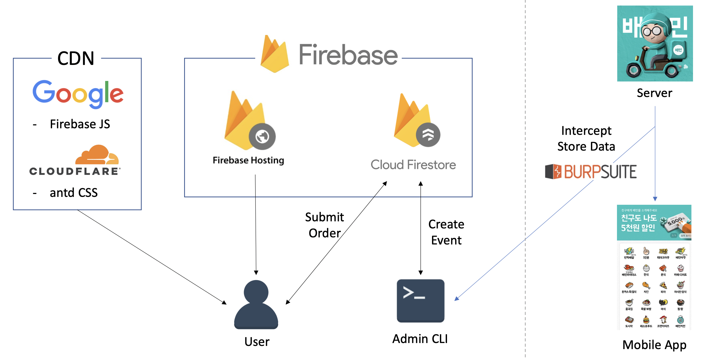

# 배달의민족 단체 주문 메뉴 접수 및 취합 웹앱

**💡Motivation💡** : 배민 단체 주문시 구글 설문조사처럼 링크 뿌리면 각자 메뉴 접수하고 주문하는 사람에게 취합해서 보여주면 편할것 같다!

## Features

- 식사 이벤트 별로 구글 설문조사처럼 고유한 URL 생성
- **식사 참여자**는 URL로 접속해 원하는 메뉴를 고른 후 주문 접수
- **주문 담당자**는 메뉴 취합 페이지를 확인 후 배민 앱으로 주문 진행

# Tech Stack

# Architecture

## Components

- CDN
    - Hosting 비용 최적화를 위해 Firebase 자바스크립트 라이브러리, antd CSS는 자체 제공하는 CDN 사용
- Firebase
    - 웹사이트 호스팅으로 Hosting, 데이터베이스로 Firestore 사용
- 배민 서버 & 앱
    - 상점 데이터를 얻기 위해 [Burp Suite](https://portswigger.net/burp)를 사용해 실제 배민 앱에서 주고받는 상점 데이터 스니핑
    - ❗️**메뉴와 가격 정보를 제외한 다른 상점 정보는 제거 후 사용**
- User
    - 주문을 접수하는 **식사 참여자**
    - 전달받은 식사 이벤트 URL로 접속해 메뉴를 고른 후 제출
- Admin CLI
    - 상점 정보를 바탕으로 이벤트 URL을 생성해 배포하는 **주문 담당자**
    - Node.js로 제작된 CLI를 사용해 상점 데이터 획득 및 이벤트 생성 (미공개)

# Demo

[https://lunatk.github.io/baemin-order-survey](https://lunatk.github.io/baemin-order-survey)

# A Desclaimer
- 본 프로젝트는 일반 사용 목적으로 제작되지 않았습니다.
    - 본 프로젝트는 배달의민족 내부 API를 사용하나, 해당 API가 공개 API가 아니라 무단 사용으로 인한 위법성 여지가 있어 해당 부분은 공개하지 않습니다(**Admin CLI**).
- 본 프로젝트는 배달의민족에 영업적 불이익을 끼치거나 경쟁관계에서 우위를 점하기 위해 배민 API를 사용하지 않았으며, Firestore에 최소한의 필요한 정보만을 재가공하여 저장하였습니다.
    - 법원 판결 참고사례 : [法 “여기어때, 야놀자 정보 무단수집 맞다”...前 대표 ‘유죄’](https://n.news.naver.com/mnews/article/092/0002180583?sid=001)
    - 추후 배달의민족에서 요청시 즉각 사용을 중단할것을 약속합니다.